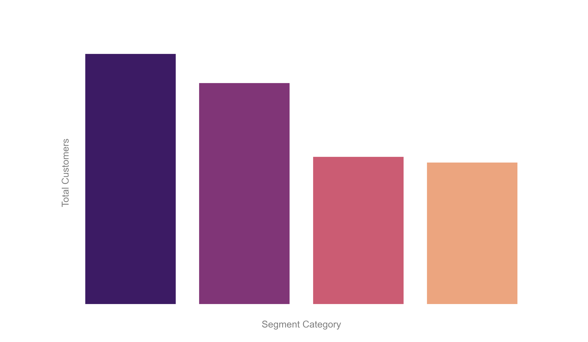

# Customer Segmentation Analysis Dashboard 📊


## 🚀 Live Demo
**[View the Interactive Dashboard Here](https://rfm-analysis-dashboard-live.netlify.app/)**

---

## 📌 Project Overview
In the competitive retail landscape, treating all customers the same leads to wasted marketing budget. This project analyzes **4,000+ transaction records** from a UK-based online retailer to identify unique customer cohorts.

Using the **RFM (Recency, Frequency, Monetary)** methodology, I segmented the customer base to provide the marketing team with actionable, data-driven targeting strategies.

## 💼 Business Problem
The marketing team needed a way to:
1.  Identify their most loyal customers (**Champions**) for reward programs.
2.  Flag customers who are churning (**At Risk**) for immediate re-engagement.
3.  Automate the reporting process to replace manual Excel sheets.

## 🛠️ The Solution
I built an automated Python pipeline that:
* **Cleans Data:** Removes null IDs and negative quantity (returns) transactions.
* **Calculates RFM:** Groups data by CustomerID to calculate Recency (days since last buy), Frequency (count of orders), and Monetary (total spend).
* **Segments Users:** Applies logic to categorize users into 4 distinct groups:
    * *Champions* (High value, recent)
    * *Loyal Customers* (Steady, reliable)
    * *Needs Attention* (High value, but haven't visited recently)
    * *At Risk/Lost* (Low value, long absence)
* **Generates Report:** Automatically compiles findings into an interactive HTML dashboard.

## 📊 Key Insights & Results
* **Total Customers Analyzed:** ~4,338 unique IDs.
* **Largest Segment:** "Needs Attention" (~1,400 users). This indicates a massive opportunity to increase revenue by sending a "We Miss You" coupon campaign.
* **High Value Cohort:** Identified ~1,200 "Champions" who drive the majority of revenue.

## 📷 Project Visuals
**Segment Distribution Chart:**

*(Note: This chart is interactive in the live demo link above)*

## 💻 How to Run This Project
1.  **Clone the repo:**
    ```bash
    git clone [https://github.com/YourUsername/Customer-Segmentation-Analysis.git](https://github.com/YourUsername/Customer-Segmentation-Analysis.git)
    ```
2.  **Install dependencies:**
    ```bash
    pip install pandas plotly openpyxl
    ```
3.  **Run the script:**
    ```bash
    python project.ipynb
    ```
    *This will generate the `Project_Report.html` file in your directory.*

---
**Author:** Ganesh Sirvi